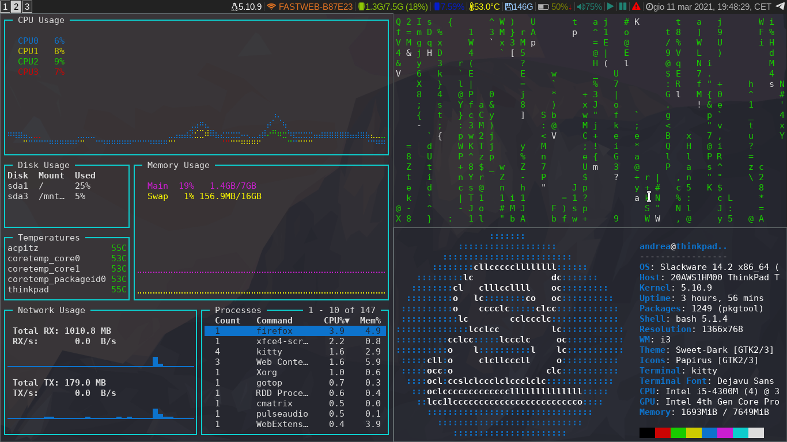
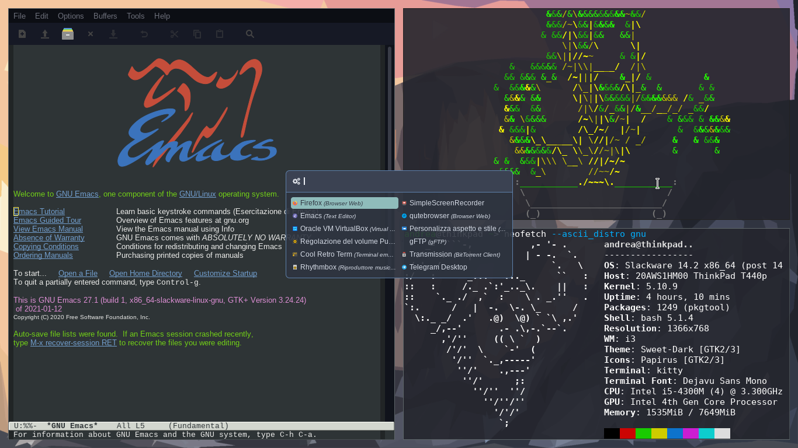

# dotfiles
i3 dotfiles

gnu-light
nitrogen
rofi
xfce4-screenshooter

Thanks to the [endeavouros i3](https://github.com/endeavouros-team/endeavouros-i3wm-setup) config for the i3blocks scripts

_Some screenshots_

